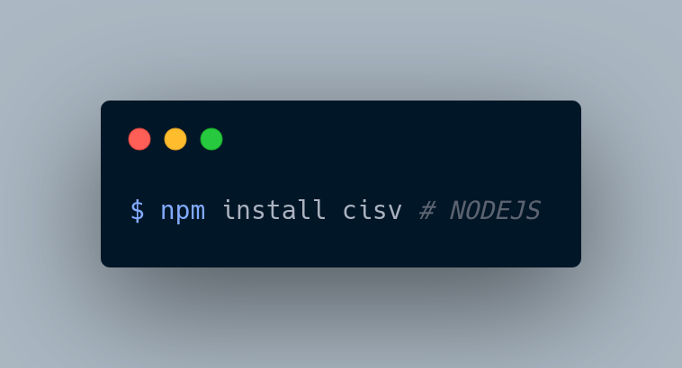

# cisv-nodejs



[](https://github.com/Sanix-Darker/cisv-nodejs/actions/workflows/ci.yml)

[](https://www.npmjs.com/package/cisv)


Node.js binding distribution for CISV with a native Node-API addon backed by `cisv-core`.

## FEATURES

- Native parser with SIMD-accelerated core
- Sync and async parsing APIs
- Streaming and chunked input support
- Iterator API for low-memory large-file processing
- Transform pipeline (C transforms + JavaScript transforms)

## INSTALLATION

### FROM NPM

```bash
npm install cisv
```

### FROM SOURCE

```bash
git clone --recurse-submodules https://github.com/Sanix-Darker/cisv-nodejs
cd cisv-nodejs
make -C core/core all
cd cisv
npm ci
npm run build
```

## CORE DEPENDENCY (SUBMODULE)

This repository tracks `cisv-core` via the `./core` git submodule.

To fetch the latest `cisv-core` (main branch) in your local clone:

```bash
git submodule update --init --remote --recursive
```

CI and release workflows also run this update command, so new `cisv-core` releases are pulled automatically during builds.

## QUICK START

```javascript
const { cisvParser } = require("cisv");

const parser = new cisvParser({ delimiter: ",", trim: true });
const rows = parser.parseSync("data.csv");
console.log(rows[0]);
```

## API EXAMPLES

### ASYNC PARSE

```javascript
const { cisvParser } = require("cisv");

(async () => {
  const parser = new cisvParser();
  const rows = await parser.parse("data.csv");
  console.log(rows.length);
})();
```

### PARSE FROM STRING

```javascript
const { cisvParser } = require("cisv");

const parser = new cisvParser();
const rows = parser.parseString("id,name\n1,alice\n2,bob");
```

### ITERATOR MODE (LARGE FILES)

```javascript
const { cisvParser } = require("cisv");

const parser = new cisvParser({ trim: true });
parser.openIterator("very_large.csv");

let row;
while ((row = parser.fetchRow()) !== null) {
  if (row[0] === "STOP") break;
}

parser.closeIterator();
```

### TRANSFORM BY HEADER NAME

```javascript
const { cisvParser } = require("cisv");

const parser = new cisvParser();
parser.setHeaderFields(["id", "name", "email"]);
parser.transformByName("name", "uppercase");

const rows = parser.parseString("id,name,email\n1,john,john@example.com");
console.log(rows[1][1]); // JOHN
```

## EXAMPLES DIRECTORY

Runnable examples are available in [`examples/`](./examples):

- `basic.js`
- `iterator.js`
- `sample.csv`

## TESTING

```bash
cd cisv
npm test
```

## BENCHMARKS

The benchmark output includes both full parse and iterator paths (including `cisv-iterator`).

```bash
docker build -t cisv-node-bench -f cisv/benchmarks/Dockerfile .
docker run --rm --platform linux/amd64 --cpus=2 --memory=4g cisv-node-bench
```

## UPSTREAM CORE

- cisv-core: https://github.com/Sanix-Darker/cisv-core
